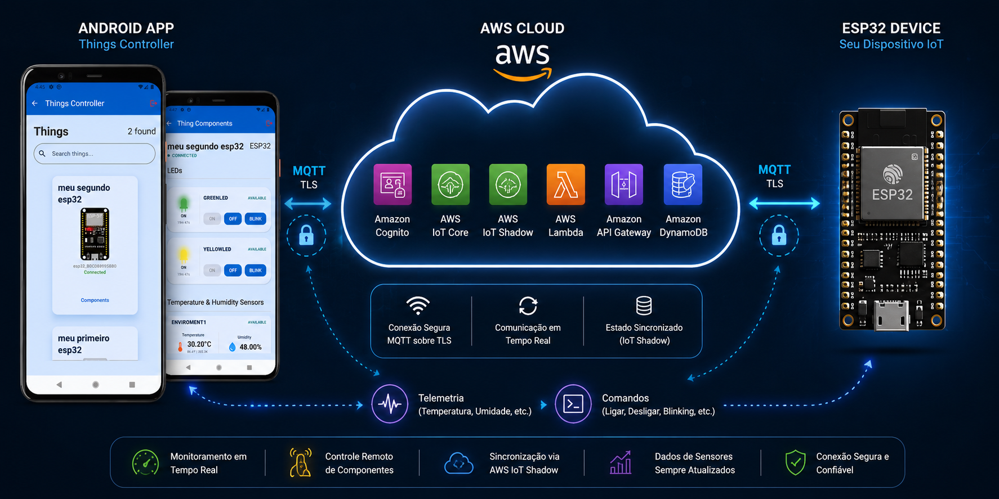
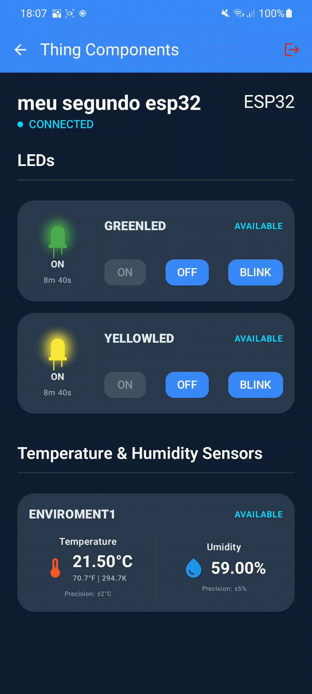

# Things Controller
Aplicação Android para monitoramento e controle de dispositivos IoT em tempo real utilizando AWS IoT Core, MQTT e Clean Architecture

## Demonstração

<table style="border-collapse: collapse; width: 100%;">
  <tr>
    <td style="vertical-align: top; width: 360px; padding: 12px;">
      
    </td>
    <td style="vertical-align: top; padding: 12px;">
      <strong>1. Autenticação e carregamento inicial</strong>
      <p>Demonstra o fluxo de autenticação do usuário utilizando AWS Cognito, seguido pelo carregamento assíncrono das Things registradas e sincronização inicial dos estados de cada dispositivo.</p>
    </td>
  </tr>
  <tr>
    <td style="vertical-align: top; width: 360px; padding: 12px;">
      
    </td>
    <td style="vertical-align: top; padding: 12px;">
      <strong>2. Monitoramento em tempo real dos dispositivos</strong>
      <p>Exibe a atualização dinâmica do estado de conectividade da Thing, carregamento automático dos seus componentes (LEDs, sensores, etc.) e renderização reativa da interface utilizando Jetpack Compose.</p>
    </td>
  </tr>
  <tr>
    <td style="vertical-align: top; width: 360px; padding: 12px;">
      
    </td>
    <td style="vertical-align: top; padding: 12px;">
      <strong>3. Controle remoto e atualização de telemetria</strong>
      <p>Demonstra o envio de comandos MQTT para atuadores (LEDs), atualização em tempo real dos estados dos componentes e sincronização bidirecional utilizando AWS IoT Device Shadow.</p>
      <p><em>Obs: no vídeo o carregamento aparenta estar mais lento devido à conversão/renderização, mas na aplicação real a resposta ocorre de forma mais rápida.</em></p>
    </td>
  </tr>
  <tr>
    <td style="vertical-align: top; width: 360px; padding: 12px;">
      
    </td>
    <td style="vertical-align: top; padding: 12px;">
      <strong>4. Resultado</strong>
      <p>Mostra a o resultado de comandos enviados sendo aplicados de fato no dois ESP32. Nele é possível ver os LEDs, incialmente desligados, ligando e/ou piscando e desligando.</p>
    </td>
  </tr>
</table>

## Funcionalidades
- **Login**: Sistema de login integrado ao AWS Cognito (via Amplify). Dada as regras de negócio, novos usuários não podem ser autocadastrar.

- **Monitoramento em Tempo Real**: Observação contínua do estado dos dispositivos (conectado/desconectado) e de seus componentes via protocolo MQTT (AWS IoT Shadow).

- **Controle Remoto**: Envio de comandos para dispositivos, como ligar, desligar ou colocar LEDs em modo "Blinking".

- **Visualização de Telemetria**: Exibição de dados de sensores, como temperatura e umidade, com atualização automática.

- **Monitoramento de Conectividade**: Verificação ativa da conexão de internet do smartphone, exibindo alertas (Snackbars) quando o usuário fica offline ou online.

- **Interface Reativa**: UI construída em Jetpack Compose que reage instantaneamente a mudanças de estado, com suporte total a modo claro/escuro. 

- **Feedback de Operações**: Indicadores de carregamento para comandos pendentes e estados visuais específicos para dispositivos desconectados (efeito de blur/desfoque).

## Tech Stack
### Android
- Kotlin
- Jetpack Compose
- Hilt
- Retrofit
- MVVM
- Clean Architecture

### AWS
- IoT Core
- Cognito
- Lmabda
- API Gateway
- DynamoDB

## Arquitetura

O projeto segue (ou pelo menos tenta kkk) os princípios da Clean Architecture, dividido em três camadas principais:

- **Presentation**: Responsável pela interface e gerenciamento de estado utilizando ViewModels e Jetpack Compose.

- **Domain**: Contém regras de negócio, entidades e casos de uso da aplicação.

- **Data**: Responsável pela comunicação com APIs, AWS IoT Core e persistência de dados.

## Estrutura do Projeto

## Estrutura do Projeto

```text
data/
├── auth/              - Gestão de autenticação e integração com AWS Cognito/Amplify
├── datasource/        - Fontes de dados e integrações externas
│   └── impl/          - Implementações concretas de DataSources, APIs Retrofit e clientes MQTT
│       ├── datastore/ - Persistência local de tokens e preferências
│       └── retrofit/  - Interfaces, interceptores e configuração das chamadas REST
└── model/             - Estruturas de dados da camada Data
    ├── dto/           - Objetos de Transferência de Dados (respostas brutas das APIs/AWS)
    │   └── shadow/    - Modelos específicos para o JSON do AWS IoT Shadow
    └── mapper/        - Conversão entre DTOs (Data) e Entidades (Domain)

di/
└── modules/           - Configuração de injeção de dependências com Hilt

domain/
├── model/             - Entidades puras e regras de negócio essenciais
│   ├── command/       - Modelos de comandos para atuadores (LED, buzzer, etc.)
│   ├── component/     - Definições de tipos, estados e ações dos componentes IoT
│   │   └── instance/  - Especializações de componentes (LED, temperatura, umidade, etc.)
│   ├── exception/     - Exceções personalizadas da regra de negócio
│   └── thing/         - Modelos centrais dos dispositivos (Things) e seus estados
├── repository/        - Interfaces (contratos) responsáveis pelo acesso aos dados
└── usecase/           - Casos de uso contendo regras de negócio específicas da aplicação

presentation/
├── navigation/        - Definição do fluxo de navegação e rotas tipadas (Type-Safe)
├── view/              - Componentes visuais e interfaces de usuário
│   ├── composables/   - Componentes reutilizáveis de UI (LEDs, TopBar, Cards, etc.)
│   ├── screen/        - Telas principais da aplicação (Home, Login, Detalhes, etc.)
│   └── ui/            - Identidade visual e Design System
│       └── theme/     - Configuração de cores, tipografia e temas (Light/Dark Mode)
└── viewmodel/         - Gerenciamento de estado da UI e mediação entre Views e Use Cases
```

## Configuração
Esta seção não detalha exatamente o processo completo de configuração necessário para a execução do projeto, pois envolve múltiplos componentes (AWS, Android e ESP32). Entretanto, abaixo estão os principais serviços e recursos utilizados.

### AWS
- **Cognito User Pool**  
  Responsável pela autenticação de usuários da aplicação.

- **AWS IoT Core**  
  Utilizado para comunicação MQTT em tempo real entre o aplicativo Android e os dispositivos IoT.

- **AWS IoT Shadow**  
  Responsável pela sincronização do estado dos dispositivos.

- **Lambda Functions**  
  Utilizadas para processamento backend e integração entre serviços AWS.

- **API Gateway**  
  Responsável pela exposição do endpoint REST consumido pelo aplicativo.

- **DynamoDB**  
  Utilizado para persistência de informações relacionadas aos dispositivos e os seus componentes.

### Android
- **AWS Amplify**  
  Configurado para integração com o AWS Cognito e gerenciamento de autenticação.

- **AWS Android SDK**  
  Utilizado para comunicação com serviços AWS, principalmente AWS IoT Core.

- **Permissões de Rede**  
  Configuração das permissões necessárias para acesso à internet e comunicação MQTT.

- **Jetpack Compose**  
  Utilizado para construção da interface reativa da aplicação.

- **Hilt**  
  Configurado para gerenciamento de dependências e injeção de objetos.

- **Retrofit**  
  Configurado para consumo dos endpoints REST expostos pelo API Gateway.

### Dispositivo IoT (ESP32)
- Configuração de conexão MQTT com AWS IoT Core.
- Configuração de certificados e policies do AWS IoT.
- Publicação de telemetria de sensores.
- Recebimento de comandos enviados pelo aplicativo Android.
- Atualização do estado do dispositivo via Device Shadow.